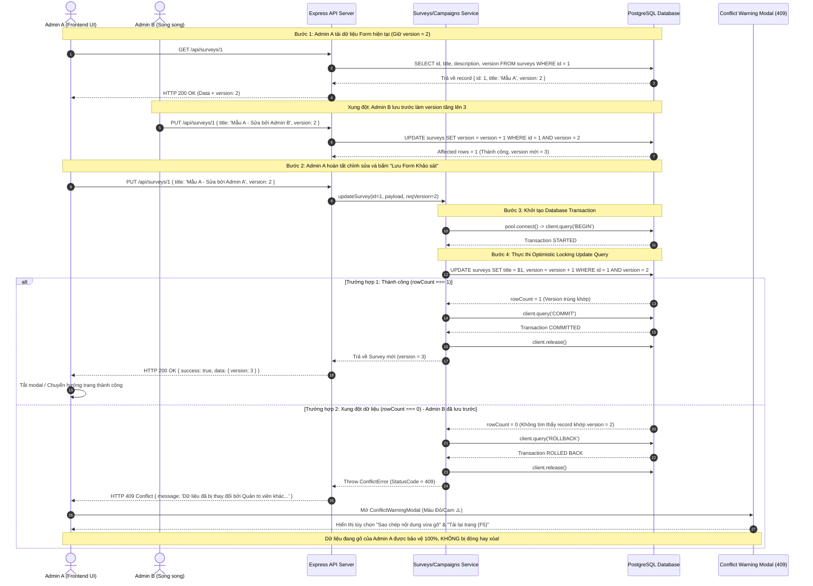

# Kỹ thuật Luồng Dữ liệu: Lưu Form Khảo sát (Database Transaction & Optimistic Locking)

Tài liệu này mô tả chi tiết luồng xử lý dữ liệu của chức năng **Lưu / Cập nhật Form Khảo sát** trong hệ thống **EvalFlow**, áp dụng cơ chế bảo vệ tính toàn vẹn **PostgreSQL Database Transactions** (`BEGIN ... COMMIT ... ROLLBACK`) và quản lý đồng thời **Optimistic Locking** (`version INT`).

---

## 1. Biểu đồ Tuần tự (Mermaid Sequence Diagram)



---

## 2. Giải thích Chi tiết Luồng Xử lý

### A. Giai đoạn 1: Đọc & Khởi tạo State
1. Khi Admin A mở trang chỉnh sửa Form Khảo sát, Frontend gửi request `GET /api/surveys/:id`.
2. Backend trả về Object dữ liệu kèm thuộc tính `version` (Ví dụ: `version = 2`).
3. Frontend lưu trữ giá trị `version` này vào state ẩn trong ứng dụng.

### B. Giai đoạn 2: Khởi tạo Transaction trên Backend
1. Admin A chỉnh sửa tiêu đề/câu hỏi và bấm **Lưu**.
2. Frontend gửi request `PUT /api/surveys/:id` kèm theo body chứa `version: 2`.
3. Backend lấy một Client connection từ Postgres Pool và gọi lệnh `BEGIN` để mở một Transaction nguyên tố.

### C. Giai đoạn 3: Kiểm tra Optimistic Locking
Backend thực thi câu lệnh SQL với điều kiện ràng buộc `version`:
```sql
UPDATE surveys
SET title = $1,
    description = $2,
    theme_config = $3::jsonb,
    version = version + 1
WHERE id = $4 AND version = $5
RETURNING id, version;
```

- **Kịch bản A (rowCount = 1)**: Số bản ghi bị ảnh hưởng là 1. Dữ liệu chưa bị ai sửa đổi. Backend gọi `COMMIT`, giải phóng Client và trả về `HTTP 200 OK`.
- **Kịch bản B (rowCount = 0)**: Bản ghi đã bị Admin B lưu trước đó khiến `version` trong CSDL tăng lên `3`. Điều kiện `WHERE version = 2` bị thất bại. Backend lập tức:
  1. Gọi `ROLLBACK` để hủy bỏ mọi thay đổi pending.
  2. Giải phóng kết nối `client.release()`.
  3. Throw `ConflictError` và gửi về Client response `HTTP 409 Conflict`.

### D. Giai đoạn 4: Xử lý Trải nghiệm Người dùng trên Frontend (UX)
1. Frontend nhận mã lỗi `HTTP 409 Conflict`.
2. Bật Component `<ConflictWarningModal />` giao diện màu Đỏ/Cam.
3. **Giữ nguyên toàn bộ nội dung Admin A vừa gõ trong Form**, cho phép bấm nút **Sao chép nội dung** hoặc **F5 Tải lại trang** để nhận bản cập nhật mới nhất mà không sợ bị mất trắng công sức.
